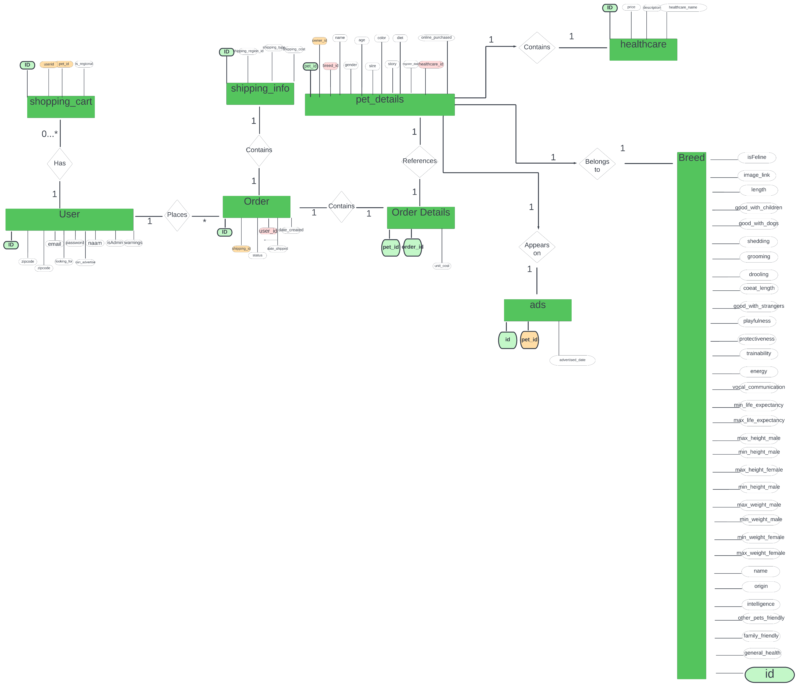

### 0. Install and run Apache(+php) & Mysql via XAMPP (tested on 8.1.12)

### 1. Run /data/127_0_0_1.sql on /phpmyadmin URI

### 2. ERD

Raw unsalted testing environment credentials: 
<pre>
"url","username","password"
"http://localhost","Webuser","Lab2021"
"http://localhost","Webuser@gfkjgfklgjklj.ce","Lab2021"
"http://localhost","CINDY.EEKELS@CDSurfing.be","bu391"
"http://localhost","GUNTHER.MERGAN@CDSurfing.be","ze818"
"http://localhost","Joe.Biden@whitehouse.gov","USA1234567890" // ADMIN
"http://localhost","mark.rutte@holland.nl","LeukeCADEAUTJES5478547497^&*" // ADMIN
"http://localhost","jeac@gmail.be","pepe123123" // ADMIN
"http://localhost","MARIO.REVERSE@CDSurfing.be","wu179"
"http://localhost","juanadarco@france.fr","pJYE9xyGLqX8xj7"
"http://localhost","joana.darco@france.fr","Lab2021"
</pre>
