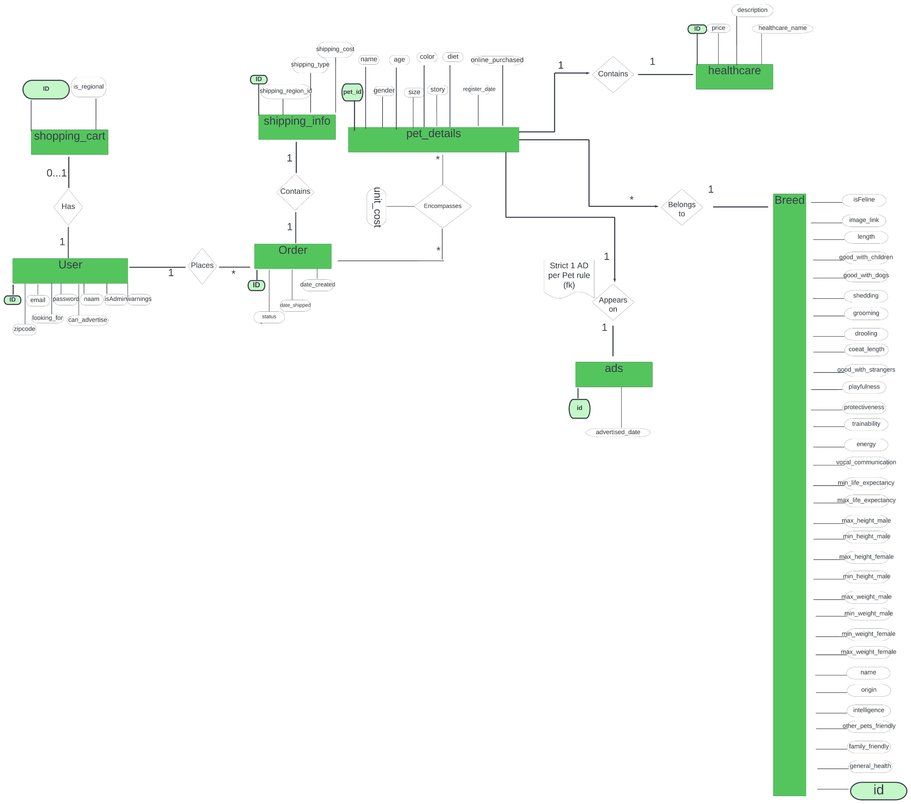
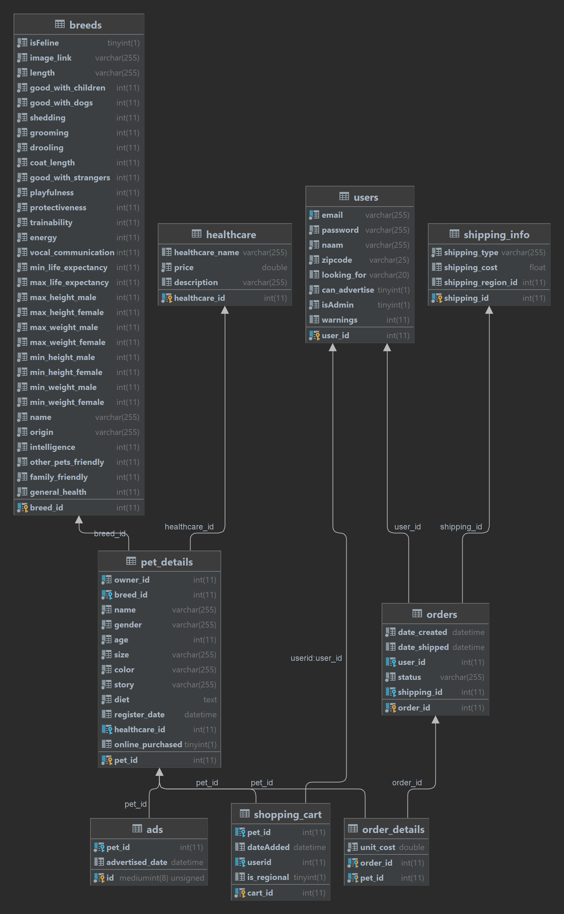

Max Iturria 2AI(E) r0834721

# Webshop PHP & MySQL

## Please read the documentation!

There are Docker files included for this project. The mysql database name is thus ***not*** `localhost` but `mysql` instead.  
You need to change this value in order to run it with Docker Compose successfully. (location) : `./pdo.php`.
If you intend to run it locally with XAMPP installed, please leave the files as-is. Tested on bundle v8.1.12.

```php
$pdo = new PDO(
    'mysql:host=localhost;port=3306;dbname=pets',
    'Webuser',
    "Lab2021",
    array(PDO::MYSQL_ATTR_FOUND_ROWS => true)
); // <- Change here on Line 15!
```

- SQL dump is in `data/127_0_0_1.sql`
- This website was developed in Chromium, quickly checked in Firefox.
- The `ban` feature was barely implemented, but feel free to try it.
  
**Some dummy accounts:**
  
| E-mail                      | Password                     | Role        |
| --------------------------- | ---------------------------- | ----------- |
| jeac@gmail.be               | pepe123123                   | admin       |
| CINDY.EEKELS@CDSurfing.be   | bu391                        | normal user |
| mark.rutte@holland.nl       | LeukeCADEAUTJES5478547497^&* | admin       |
| GUNTHER.MERGAN@CDSurfing.be | ze818                        | normal user |

The admin panel can be found at `admin.php` or by clicking on the yellow navbar after log-in.

## Checklist

### Hand-in

- [X] Your webshop
  - Everything in this root folder
- [X] SQL file to load database
- [X] ER diagram
  - PHP.png
    - 
  - PHP_diagram.png
    - 

## SQL

SQL dump is available in `data/127_0_0_1.sql`.

### Table creation

```sql
USE `pets`;

CREATE TABLE `ads` (
  `id` mediumint(8) UNSIGNED NOT NULL,
  `pet_id` int(11) NOT NULL,
  `advertised_date` datetime DEFAULT current_timestamp()
) ENGINE=InnoDB DEFAULT CHARSET=utf8mb4;

CREATE TABLE `breeds` (
  `breed_id` int(11) NOT NULL,
  `isFeline` tinyint(1) NOT NULL,
  `image_link` varchar(255) NOT NULL,
  `length` varchar(255) NOT NULL,
  `good_with_children` int(11) NOT NULL,
  `good_with_dogs` int(11) NOT NULL,
  `shedding` int(11) NOT NULL,
  `grooming` int(11) NOT NULL,
  `drooling` int(11) NOT NULL,
  `coat_length` int(11) NOT NULL,
  `good_with_strangers` int(11) NOT NULL,
  `playfulness` int(11) NOT NULL,
  `protectiveness` int(11) NOT NULL,
  `trainability` int(11) NOT NULL,
  `energy` int(11) NOT NULL,
  `vocal_communication` int(11) NOT NULL,
  `min_life_expectancy` int(11) NOT NULL,
  `max_life_expectancy` int(11) NOT NULL,
  `max_height_male` int(11) NOT NULL,
  `max_height_female` int(11) NOT NULL,
  `max_weight_male` int(11) NOT NULL,
  `max_weight_female` int(11) NOT NULL,
  `min_height_male` int(11) NOT NULL,
  `min_height_female` int(11) NOT NULL,
  `min_weight_male` int(11) NOT NULL,
  `min_weight_female` int(11) NOT NULL,
  `name` varchar(255) NOT NULL,
  `origin` varchar(255) NOT NULL,
  `intelligence` int(11) NOT NULL,
  `other_pets_friendly` int(11) NOT NULL,
  `family_friendly` int(11) NOT NULL,
  `general_health` int(11) NOT NULL
) ENGINE=InnoDB DEFAULT CHARSET=utf8mb4;

CREATE TABLE `healthcare` (
  `healthcare_id` int(11) NOT NULL,
  `healthcare_name` varchar(255) DEFAULT NULL,
  `price` double NOT NULL,
  `description` varchar(255) DEFAULT NULL
) ENGINE=InnoDB DEFAULT CHARSET=utf8mb4;

CREATE TABLE `orders` (
  `order_id` int(11) NOT NULL,
  `date_created` datetime NOT NULL DEFAULT current_timestamp(),
  `date_shipped` datetime DEFAULT (current_timestamp() + interval 7 day),
  `user_id` int(11) DEFAULT NULL,
  `status` varchar(255) NOT NULL,
  `shipping_id` int(11) DEFAULT NULL
) ENGINE=InnoDB DEFAULT CHARSET=utf8mb4;

CREATE TABLE `order_details` (
  `order_id` int(11) NOT NULL,
  `pet_id` int(11) NOT NULL,
  `unit_cost` double NOT NULL
) ENGINE=InnoDB DEFAULT CHARSET=utf8mb4;

CREATE TABLE `pet_details` (
  `pet_id` int(11) NOT NULL,
  `owner_id` int(11) NOT NULL,
  `breed_id` int(11) NOT NULL,
  `name` varchar(255) NOT NULL,
  `gender` varchar(255) NOT NULL,
  `age` int(11) NOT NULL,
  `size` varchar(255) NOT NULL DEFAULT 'Medium',
  `color` varchar(255) NOT NULL DEFAULT 'Black',
  `story` varchar(255) NOT NULL,
  `diet` text NOT NULL,
  `register_date` datetime DEFAULT current_timestamp(),
  `healthcare_id` int(11) DEFAULT floor(4 + rand() * (7 - 4 + 1)),
  `online_purchased` tinyint(1) DEFAULT 0
) ENGINE=InnoDB DEFAULT CHARSET=utf8mb4;

CREATE TABLE `shipping_info` (
  `shipping_id` int(11) NOT NULL,
  `shipping_type` varchar(255) NOT NULL DEFAULT 'BusinessWeek',
  `shipping_cost` float DEFAULT NULL,
  `shipping_region_id` int(11) DEFAULT NULL
) ENGINE=InnoDB DEFAULT CHARSET=utf8mb4;

CREATE TABLE `shopping_cart` (
  `cart_id` int(11) NOT NULL,
  `pet_id` int(11) DEFAULT NULL,
  `dateAdded` datetime DEFAULT current_timestamp(),
  `userid` int(11) DEFAULT NULL,
  `is_regional` tinyint(1) DEFAULT NULL
) ENGINE=InnoDB DEFAULT CHARSET=utf8mb4;

CREATE TABLE `users` (
  `user_id` int(11) NOT NULL,
  `email` varchar(255) NOT NULL,
  `password` varchar(255) NOT NULL,
  `naam` varchar(255) NOT NULL,
  `zipcode` varchar(25) NOT NULL,
  `looking_for` varchar(20) DEFAULT NULL,
  `can_advertise` tinyint(1) NOT NULL,
  `isAdmin` tinyint(1) NOT NULL,
  `warnings` int(11) DEFAULT NULL
) ENGINE=InnoDB DEFAULT CHARSET=utf8mb4;
```

### Insert basic data

```sql
-- User roles
INSERT INTO `users` (`user_id`, `email`, `password`, `naam`, `zipcode`, `looking_for`, `can_advertise`, `isAdmin`, `warnings`) VALUES
(1, 'GUNTHER.MERGAN@CDSurfing.be', '$2y$10$8o.mgGy3.wZFCF1WJAKvn.BDbyn6V4JRhkqMXtEZGPxaAcoJVuh1a', 'GUNTHER MERGAN', '2800', 'Cat', 0, 0, 1),
(2, 'MARCEL.VANDENBERGE@CDSurfing.be', 'mu923', 'MARCEL VANDENBERGE', '2800', 'Dog', 1, 0, 0),
(3, 'JEROEN.VANBERKEL@CDSurfing.be', 'xe854', 'JEROEN VANBERKEL', '2800', 'Dog', 0, 0, 0),
(4, 'CINDY.EEKELS@CDSurfing.be', '$2y$10$zqRgQ.YDzJuH5tecBH9m3.OrN41klCrp8aNA4Ojxem7PQGWKrdMG6', 'CINDY EEKELS', '2800', 'Cat', 1, 0, 4);
-- A normal visitor is not included, not necessary because no account
```
